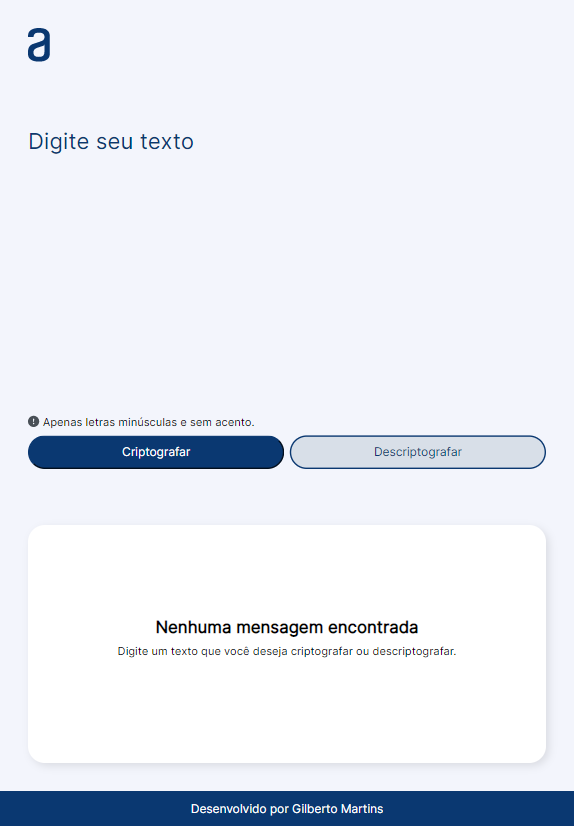

# Challenge ONE - Sprint 01 Construa um decodificador

## Sobre o desafio

Boas vindas ao primeiro desafio! 

#challengeonedecodificador4

Durante estas duas semanas, vamos trabalhar em uma aplicação que criptografa textos, assim você poderá trocar mensagens secretas com outras pessoas que saibam o segredo da criptografia utilizada.

As "chaves" de criptografia que utilizaremos são:
A letra "e" é convertida para "enter"
A letra "i" é convertida para "imes"
A letra "a" é convertida para "ai"
A letra "o" é convertida para "ober"
A letra "u" é convertida para "ufat"

Requisitos:
+ Deve funcionar apenas com letras minúsculas
+ Não devem ser utilizados letras com acentos nem caracteres especiais
+ Deve ser possível converter uma palavra para a versão criptografada e também retornar uma palavra criptografada para a versão original.

Por exemplo:
"gato" => "gaitober"
gaitober" => "gato"

A página deve ter campos para inserção do texto a ser criptografado ou descriptografado, e a pessoa usuária deve poder escolher entre as duas opções
O resultado deve ser exibido na tela.
Extras:
+ Um botão que copie o texto criptografado/descriptografado para a área de transferência - ou seja, que tenha a mesma funcionalidade do ctrl+C ou da opção "copiar" do menu dos aplicativos.

Temos um período de tempo de quatro semanas para desenvolver o projeto e vamos trabalhar com o sistema ágil de desenvolvimento, utilizando o Trello da seguinte forma:

1. A coluna Pronto pra iniciar apresenta os cartões com os elementos ainda não desenvolvidos.
2. Já na coluna Desenvolvendo ficarão os elementos que você estiver desenvolvendo no momento. Ao iniciar uma tarefa, você poderá mover o cartão que contém a tarefa para esta coluna.
3. No Pausado estarão os elementos que você começou a desenvolver, mas precisou parar por algum motivo.
4. Por fim, a coluna Concluído terá os elementos já concluídos.

O Trello é uma ferramenta de uso individual para você controlar o andamento das suas atividades, mas ela não será avaliada.

Bom projeto!

## Resultado do desafio

### Layout na versão para desktop

### Layout na versão para tablet

### Layout na versão para celular

